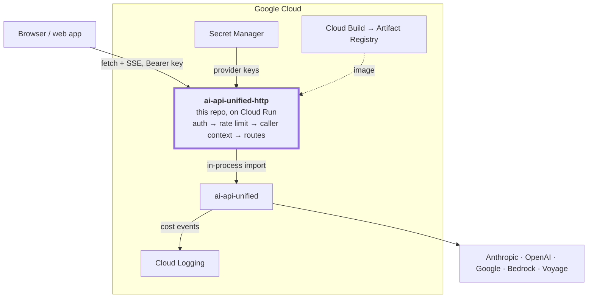

# ai-api-unified-http 1.6.0

HTTP interface to the [ai-api-unified](https://github.com/davecthomas/ai-api-unified)
Python library, for web apps and other non-Python consumers. One implementation
of provider logic, pricing, model lifecycle, and middleware — exposed over
REST, with TypeScript clients generated from the OpenAPI spec.

Every documented endpoint is live. See
[docs/requirements.md](docs/requirements.md) for scope and
[docs/technical-design.md](docs/technical-design.md) for the endpoint-to-library
mapping.

## Architecture



The service is a thin adapter. Provider logic, pricing, lifecycle enforcement,
and middleware all stay in the library.

## Setup

Requires Python `>=3.11,<3.14` and [Poetry](https://python-poetry.org/). The
provider SDKs arrive as extras of the pinned library, so there is nothing
separate to install.

```bash
poetry install --extras dev
make env            # copies a .env from a sibling ai_api_unified checkout, if you have one
```

`make env` looks for a checkout of the library beside this one and copies its
`.env`, because the provider variable names are identical, so a file that works
there works here. With no such checkout it says so and points at
[`env_template`](env_template), which is the path that needs nothing but this
repo. Either way it refuses to overwrite an existing `.env`.

After copying, check `COMPLETIONS_MODEL_NAME`:

- `COMPLETIONS_MODEL_NAME` must belong to `COMPLETIONS_ENGINE`. A Gemini model
  name against the `claude` engine reaches Anthropic and returns 404.
- Comment the line out to use the engine's default. An empty assignment is not
  the same as unset: the value is forwarded and the provider rejects it.

`.env` is a local-development convenience. It is read at startup when present,
and real environment variables always win, so a deployment supplying its own
configuration is never overridden. Deployments ship no `.env` — see
[Deploy](#deploy).

### Authentication

Every `/v1` endpoint spends provider credits, and callers never hold provider
keys, so an unauthenticated endpoint lets anyone spend against your provider
account. The service refuses to start unless authentication is configured or
explicitly turned off.

`HTTP_API_KEYS` takes comma-separated entries, each `label:key` or a bare
`key`. The label names the calling application in logs and authenticates
nothing. Several keys can be live at once, so a caller can be rotated or
revoked without disturbing the rest.

```bash
HTTP_API_KEYS="webapp:$(openssl rand -hex 32),batch:$(openssl rand -hex 32)"
curl -H "Authorization: Bearer $KEY" "http://localhost:8080/v1/models?engine=claude"
```

`/health`, `/healthz`, `/openapi.json`, `/docs`, and `/redoc` need no key.
Health answers load balancers that hold no credential, and the OpenAPI document
is what the TypeScript client is generated from.

`HTTP_AUTH_DISABLED=1` turns authentication off for local work, and the service
warns on every start that any caller can spend credits.

### Rate limiting

`HTTP_RATE_LIMIT` caps requests per key per window, defaulting to 60 per 60
seconds. Authentication answers who may call; this answers how much they may
spend. A leaked key otherwise runs up an unbounded bill.

The count lives in process memory, so it is per worker: the effective ceiling
is the limit times `WEB_CONCURRENCY`. Size it accordingly, or set
`HTTP_RATE_LIMIT=0` to disable. An exact global ceiling needs shared state,
which this does not provide.

Responses carry `X-RateLimit-Limit` and `X-RateLimit-Remaining`; a 429 adds
`Retry-After`.

Requests that fail authentication are counted too, against the caller's
address, and answer 429 once that address is over budget. They never reach the
per-key counter, so without this a caller holding no key could retry without
limit and spend the deployment's log budget doing it.

The address comes from the socket by default. Behind a proxy that is the
proxy, putting every caller in one bucket, so set `HTTP_CLIENT_IP_FROM_XFF=1`
to read `X-Forwarded-For` instead. Only its last entry is read, because a
proxy appends the address it accepted the connection from and everything
earlier is whatever the client sent. `make gcp-deploy` sets this.

### Request size

`HTTP_MAX_REQUEST_BYTES` caps the request body, defaulting to 1 MiB, and a
larger one is refused with 413 before the body is read. The rate limiter
bounds how often a caller spends and says nothing about how much any one call
costs, so without this a single request can cost more than the rest of the
window put together.

A request that arrives chunked declares no length and passes this check; the
per-field limits in the OpenAPI document still apply once it is parsed. Those
limits — 200,000 characters for a prompt, 256 embedding inputs, 500 messages —
are part of the published contract rather than deployment configuration, since
the generated client is built from that document and would otherwise differ
per deployment.

### Cost attribution per end user

An API key identifies a calling *application*, so a web app serving a thousand
users holds one key and produces one undifferentiated spend total. Three
optional headers split it:

| Header | Lands in the cost event as |
|---|---|
| `X-Caller-Id` | `caller_id`, prefixed with the key's label |
| `X-Session-Id` | `tag_session_id` |
| `X-Workflow-Id` | `tag_workflow_id` |

```bash
curl -H "Authorization: Bearer $KEY" -H "X-Caller-Id: user-42" ...
# cost event: {"caller_id": "webapp:user-42", "usd_cost": "0.000035", ...}
```

The caller id is prefixed with the API key's label, so two applications that
both number their users from one stay apart in the record. Without the header,
spend attributes to the application alone.

These identifiers attribute spend; they grant nothing. The service cannot
verify that `X-Caller-Id: user-42` is user 42, since the calling application
asserts it. That is sound for splitting a bill among a trusted caller's own
users and useless as access control, which remains the API key's job.

Values are length-bounded and stripped of control characters, since they reach
log lines and cost records. Send an opaque, stable id; an email address or a
name would end up in the cost sink.

### Middleware and cost events

Both belong to the library, configured by one YAML at
`AI_MIDDLEWARE_CONFIG_PATH`, which defaults to
[`config/middleware.yaml`](config/middleware.yaml). The
[library README](https://github.com/davecthomas/ai-api-unified) documents what
that profile can contain.

The service adds two behaviors:

- **It refuses to start when cost events would be lost.** The library emits one
  event per call, and `emit_cost` defaults to false, so a profile without it
  publishes nothing. Startup checks the resolved setting and the handler, then
  fails with `CostEventNotCapturedError` naming the fix.
- **PII redaction is off in the shipped profile.** The library will not stream
  while redaction is on, and the profile is process-wide, so a deployment gets
  redaction or streaming. Turning it on makes streaming calls return 400.

`HTTP_COST_LOG_PATH` sets the sink, defaulting to `cost-events.jsonl`. On Cloud
Run, events go to stdout and land in Cloud Logging.

## Run

```bash
make serve          # http://localhost:8080, API key: local-dev-key
make smoke          # live checks against a running server
```

`make help` lists every target. `make smoke` calls real providers and costs a
small amount; it checks health, an unkeyed 401, buffered and streaming
completions, the model catalog, and a malformed-body 422.

- `/docs` — interactive API docs
- `/openapi.json` — the spec TypeScript clients are generated from

## Deploy

Deploys to Google Cloud Run, into your own project with your own provider
keys. The image is a plain container, so any container host will run it.

Scales to zero, wakes in seconds, and the always-free tier covers 2M requests
and 180k vCPU-seconds a month. A billing account is required even inside the
free tier.

[](https://deploy.cloud.run/?git_repo=https://github.com/davecthomas/ai-api-unified-http)

The button runs in a browser and prompts for the keys listed in
[`app.json`](app.json). It needs no local tooling.

From a checkout, with `gcloud` installed:

```bash
gcloud auth login
make gcp-project PROJECT=your-project-id BILLING=0000-0000-0000   # once
make gcp-secrets PROJECT=your-project-id
make gcp-deploy  PROJECT=your-project-id
```

Generated images and video need a bucket, created once:

```bash
make gcp-artifacts PROJECT=your-project-id
```

`make gcp-deploy` mounts it at `/artifacts` and deploys with CPU allocated
outside request processing, which a video job needs — its generation outlives
the request that started it, and a throttled instance would stall the moment
the response was sent.

`make gcp-secrets` reads the local `.env`, writes each provider key to Secret
Manager, and grants the runtime service account access. Keys reach the
container as mounted secrets, so nothing sensitive lands in the image or in the
service's environment configuration.

`make gcp-deploy` builds with Cloud Build, so no local Docker is needed.

Cloud Run answers `/healthz` at its own frontend and never forwards it to the
container. Use `/health` for health checks there; both paths return the same
body everywhere else.

### Deploying from CI

Pushing a `vX.Y.Z` tag deploys, through the same `make gcp-deploy` a human
runs, so a deploy from CI and one from a laptop cannot drift apart. Tags rather
than merges: a deploy is the step worth being deliberate about, and every merge
deploying would put a README typo into production.

The workflow holds no credential. GitHub signs a token naming the repository
and ref, Google checks it and returns an access token that lasts minutes. A
service account key would do the same job and never expire.

```bash
make gcp-cicd PROJECT=your-project-id   # once
```

That creates the identity pool, a deploy service account, and a binding that
names this repository, so a token minted by any other workflow matches nothing.
It prints three values for **Settings → Secrets and variables → Actions →
Variables**: `GCP_PROJECT`, `GCP_WIF_PROVIDER`, and `GCP_DEPLOY_SA`. They name
a project rather than granting anything, which is why they are variables and
not secrets.

Two checks guard the deploy. The tag has to match `__version__`, or a release
would deploy an image whose `/health` reports a different version. And after
deploying, `/health` is polled until it reports the version just built, so a
green run means the new revision is serving rather than that the API call
returned.

Actions is free here: this repository is public, and GitHub charges nothing for
standard runners on public repositories.

## API surface

| Method | Path | Purpose |
|---|---|---|
| POST | `/v1/completions` | Text completion; `"stream": true` for SSE |
| POST | `/v1/structured` | Schema-validated structured output |
| POST | `/v1/conversations/turn` | One stateless, tool-capable turn |
| POST | `/v1/embeddings` | Embedding vectors |
| POST | `/v1/tokens/count` | Provider-side token count |
| GET | `/v1/models?engine=` | Model catalog: lifecycle and pricing |
| POST | `/v1/batches` | Submit many prompts as one job, at batch pricing |
| GET | `/v1/batches/{id}?engine=` | Batch status and counts |
| GET | `/v1/batches/{id}/results?engine=` | Per-request results, once ended |
| POST | `/v1/batches/{id}/cancel?engine=` | Ask the provider to cancel |
| POST | `/v1/images` | Generate images; returns references, not bytes |
| POST | `/v1/videos` | Start a video generation; returns a job |
| GET | `/v1/videos/{id}` | Job status and progress |
| GET | `/v1/videos/{id}/events` | Progress as it changes (SSE) |
| GET | `/v1/artifacts/{id}/content` | Stream the bytes, resumably |
| GET | `/health`, `/healthz` | Liveness and versions |

### What a call cost

`/v1/structured` and `/v1/conversations/turn` return `usd_cost` alongside
`usage`, priced from the tokens the provider reported. No extra provider call
is made, so it costs nothing to read.

It is a string, for the reason the pricing rates are strings: these are
decimal money values that binary floating point cannot hold exactly. A model
with no rates in the registry reports `null`, never `0` — the library's own
cost helper returns 0.0 for an unpriced model, and a caller cannot tell that
apart from a call that was genuinely free.

`/v1/completions` reports no cost, because the library's buffered completion
call returns bare text with no usage to price.

### Embedding queries and documents

`/v1/embeddings` takes an optional `input_type`, forwarded to the provider
unchanged. Voyage and Gemini embed a search query differently from a stored
document, so an index built without it and searched with it returns worse
matches. Engines that do not distinguish the two ignore it.

### Images and video

Both produce bytes far too large for a JSON body, so a generating call returns
a **manifest** and the bytes are fetched separately.

That split is what buys two things. `Content-Length` on the fetch lets a client
draw a real progress bar, and `Range` lets a failed transfer resume — which
matters because generation is the expensive half and has already been paid for
by the time bytes exist.

```bash
# Images are generated inline; they take seconds.
curl -X POST "$BASE/v1/images" -H "Authorization: Bearer $KEY" \
  -H 'content-type: application/json' \
  -d '{"prompt": "a red bicycle", "num_images": 2}'
# -> {"artifacts": [{"artifact_id": "...", "size_bytes": 1841203,
#                    "mime_type": "image/png",
#                    "url_path": "/v1/artifacts/.../content"}, ...]}

curl "$BASE/v1/artifacts/<id>/content" -H "Authorization: Bearer $KEY" -o out.png
```

Video takes minutes, which is longer than a request should live, so it is a job:

```bash
curl -X POST "$BASE/v1/videos" -H "Authorization: Bearer $KEY" \
  -H 'content-type: application/json' -d '{"prompt": "a sunset", "duration_seconds": 5}'
# -> {"job_id": "...", "status": "queued", "percent": 0.0, "estimated": true}

curl "$BASE/v1/videos/<job_id>" -H "Authorization: Bearer $KEY"
curl -N "$BASE/v1/videos/<job_id>/events" -H "Authorization: Bearer $KEY"
```

#### Two kinds of progress

They are different problems and they have different answers.

**While generating, there are no bytes to measure**, so the service publishes a
figure. `/v1/videos/{id}/events` emits a `progress` event whenever it changes:

```
event: progress
data: {"job_id":"...","status":"generating","percent":42.0,"estimated":true}
```

`estimated` is the field to read. When a provider reports progress it is
`false` and the number is measured. When one does not — and many do not — the
service derives it from elapsed time, says so, and never lets a guess reach
100. Render a confident bar on a measured figure and a hedged one otherwise.

**While transferring, the client measures it** and needs nothing from the
service but an honest length:

```js
const res = await fetch(urlPath, {headers: {Authorization: `Bearer ${key}`}});
const total = +res.headers.get("Content-Length");
const reader = res.body.getReader();
let received = 0;
while (true) {
  const {done, value} = await reader.read();
  if (done) break;
  received += value.length;
  setProgress(received / total);
}
```

#### Resuming a failed transfer

`Accept-Ranges: bytes` is always sent. A client that kept what it received asks
for the rest:

```bash
curl -H "Range: bytes=1048576-" "$BASE/v1/artifacts/<id>/content" -H "Authorization: Bearer $KEY"
# 206, with Content-Range: bytes 1048576-8388607/8388608
```

A range that cannot be satisfied serves the whole body rather than failing, so
a client whose retry logic guesses wrong still gets its artifact.

#### Where artifacts live

In a bucket mounted at `HTTP_ARTIFACT_DIR`, not in the container. Cloud Run's
filesystem is in-memory, so a video would consume the instance's own memory
budget, and with several instances a retry usually reaches one that never held
the bytes.

Artifacts are namespaced by the API key's label, so one caller cannot fetch
another's by holding an id, and ids are random rather than sequential.
`HTTP_ARTIFACT_TTL_SECONDS` sets how long they are served, defaulting to a day;
the bucket's own lifecycle rule does the deleting, because a service that
scales to zero cannot be relied on to sweep.

Locally, `HTTP_ARTIFACT_DIR` is any writable directory and everything works the
same way.

### Batches

Providers that support batch charge roughly half the interactive rate and
return results in hours rather than seconds. Submit, poll, and collect are
separate calls, and the caller keeps the `batch_id`.

```bash
curl -X POST "$BASE/v1/batches" -H "Authorization: Bearer $KEY" \
  -H 'content-type: application/json' -d '{
    "engine": "claude",
    "requests": [{"custom_id": "row-1", "prompt": "Classify: ..."}]
  }'
# -> {"batch_id": "batch_abc", "status": "in_progress", ...}

curl "$BASE/v1/batches/batch_abc?engine=claude"          -H "Authorization: Bearer $KEY"
curl "$BASE/v1/batches/batch_abc/results?engine=claude"  -H "Authorization: Bearer $KEY"
```

`engine` travels with the id on every call. A batch lives inside one provider's
account, so the id alone does not say which client can ask about it.

Results correlate by `custom_id`, not by position: providers return them in
their own order. An item can fail while the batch ends normally, so read each
item's `status` before its `text`.

Results carry `usage` and no `usd_cost`. The registry's token rates are
interactive rates, and batch bills at the provider's batch rate, so a figure
computed here would overstate the real cost.

The library's blocking `run_batch` is not exposed. Behind an HTTP endpoint it
would hold a connection open for hours and lose everything if it dropped.

A batch of 1,000 prompts will exceed the 1 MiB `HTTP_MAX_REQUEST_BYTES`
default long before it reaches the 1,000-item cap, so a deployment submitting
large batches raises that setting.

### Model catalog

`engine` is required. Listing every engine would construct a client per engine
on one request, and construction re-reads configuration and makes a network
round trip on Gemini.

`models` and `catalog` are reported separately. `models` is what the provider
says is available now; `catalog` is the library's registry — lifecycle status,
sunset date, replacement, pricing. A model can appear in one and not the other,
and a provider model with no catalog entry is uncatalogued, which is not the
same as free.

Pricing rates are strings. They are decimal money values, and binary floating
point cannot hold them exactly: `0.075` arriving as `0.07499999999999999` would
be wrong in a field used to compute cost.

### Conversations are stateless

Each turn carries the full history, and the caller executes any tools the model
asks for. A turn response includes `conversation_token`; replay it by placing
it as the content of an assistant message, in the position that turn occurred:

```json
{"messages": [
  {"role": "user", "content": "first question"},
  {"role": "assistant", "content": "v1.W3siY2l0YXR..."},
  {"role": "user", "content": "follow up"}
]}
```

Ordering is yours, because only you know where a new user message belongs
relative to the previous assistant turn. Echo the token without parsing it: it
carries provider-specific content whose shape changes with the engine and the
library version. A token from an older service version is rejected with a 400.

## Versioning

The `/v1/` URI prefix bumps only on breaking request or response shapes, and
`/v1` and `/v2` can run side by side during a migration.

The service version follows semver, independently of both the URI prefix and
the pinned library. Patch for fixes and internal changes, minor for new
endpoints or fields, major for breaking deploy or config changes.
`tests/test_version_sync.py` fails when `pyproject.toml`,
`src/ai_api_unified_http/__version__.py`, and the title of this file disagree.

Releases are cut on `main` after merge: tag `vX.Y.Z` and push. A release
deploys the service; there is no PyPI publish step.

## TypeScript client

The service describes itself at `/openapi.json`: every endpoint, every field
you can send, every field that comes back. A tool reads that description and
writes the TypeScript for you. That is what "generated" means here — nobody
types the request and response shapes by hand, so they cannot disagree with the
service.

Whoever calls the API gets an editor that knows the field names:

```js
// hand-written: nothing checks this, and the typo ships
fetch("/v1/completions", { body: JSON.stringify({ engine: "claude", promt: "hi" }) });

// generated: the typo is an error before the code runs
client.raw.POST("/v1/completions", { body: { engine: "claude", promt: "hi" } });
```

Responses work the same way. `data.text` autocompletes because the tool read
the spec and knows the field exists.

[`clients/typescript`](clients/typescript) holds the client.

```ts
const client = createAiApiClient({ baseUrl, apiKey, caller: { callerId: "user-42" } });
const { data, error } = await client.raw.POST("/v1/completions", {
  body: { engine: "claude", prompt: "Name three primary colors." },
});
```

```bash
make client         # regenerate after changing any request or response shape
```

CI regenerates the spec and the client on every pull request and fails when the
committed output has moved. Streaming is hand-written, because server-sent
events are outside what OpenAPI describes.

## Browser console

[ai-api-unified-http-webapp](https://github.com/davecthomas/ai-api-unified-http-webapp)
drives every endpoint from editable inputs, renders SSE as it arrives, and
holds conversation history in the page. It is a separate repo so this one holds
only the service, and so the two version independently.

Nothing here depends on it, and it needs no checkout of this repo: it is a
static page that calls whichever service URL it is given, including a
deployment. Its README covers running it.

What this repo owes it is the CORS origin. `http://localhost:3000` is admitted
by default, which is where that console serves; deployments set
`HTTP_CORS_ORIGINS` to their real origins.
